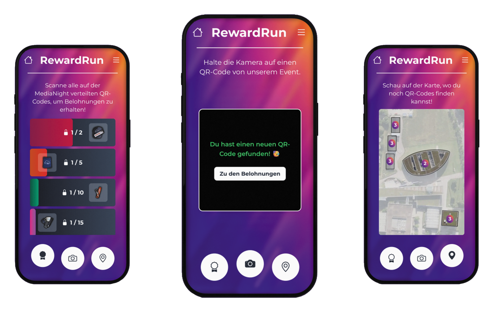

# RewardRun

## Beschreibung

RewardRun ist eine innovative Webanwendung, die es Event-Besuchern ermöglicht, QR-Codes und Bilder zu scannen, um Belohnungen freizuschalten und ihre Fortschritte zu verfolgen. Veranstalter können eigene Events erstellen, QR-Codes oder Bilder generieren und Statistiken über die gescannten Codes einsehen. RewardRun bietet eine unterhaltsame und interaktive Möglichkeit, Events zu gestalten und Besucher zu motivieren das Gelände zu erforschen.

## Entwickler

- Niklas Kieß (nk150@hdm-stuttgart.de),
- Nils Fink (nf056@hdm-stuttgart.de),
- Jan Sander (js485@hdm-stuttgart.de)
